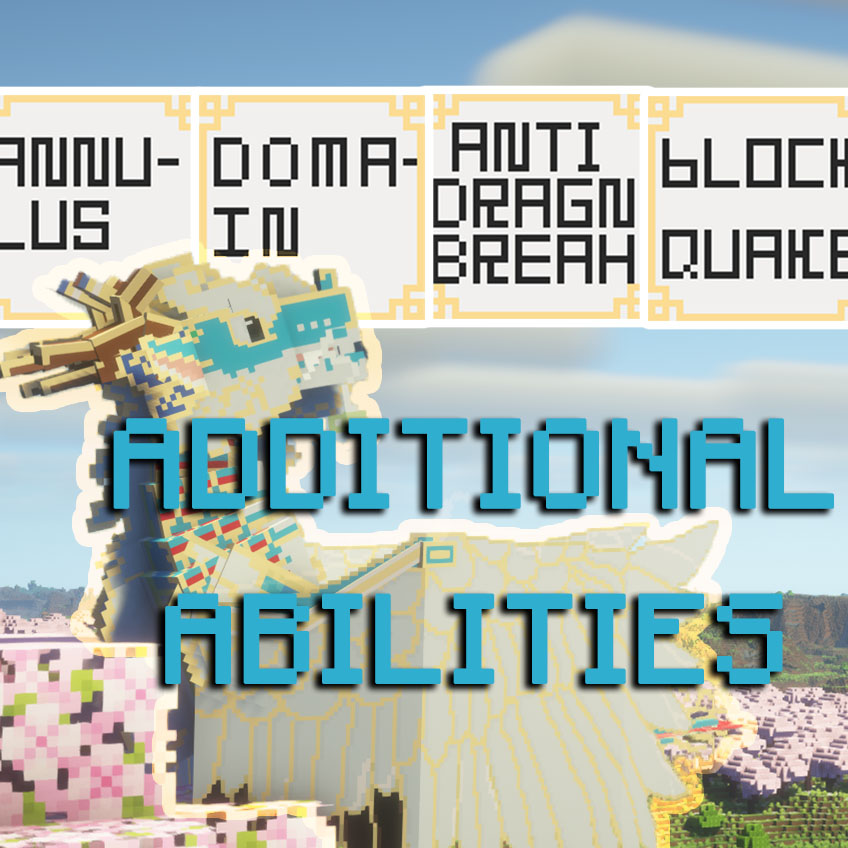
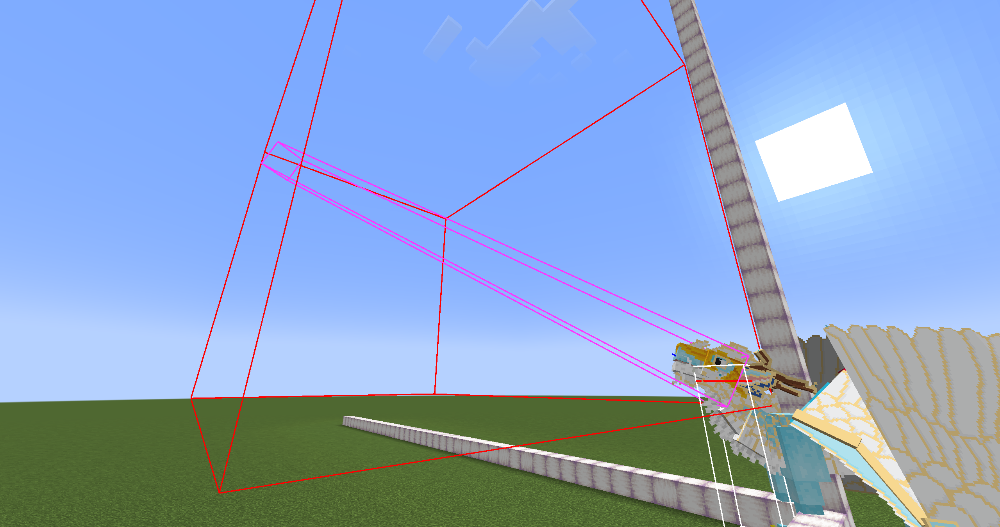

<!--
  ============================================================
  语言 / Language
  中文版位于下方 lang-zh 锚点处（「Additional Abilities for DS · 文档索引」）。
  英文版位于下方 lang-en 锚点处（「Additional Abilities for DS · Documentation Index」）。
  ============================================================
-->

**语言 / Language**：[中文](#lang-zh) · [English](#lang-en)

---



<a id="lang-zh"></a>

# Additional Abilities for DS · 文档索引

>  **Additional Abilities for DS `2.0.0`**  
> 适用版本：Minecraft `1.21.1` · NeoForge   
> 前置：
> - Dragon Survival `≥ 2.0.68` 
> - Wing Kirin `≥ 3.3.0`  

> 最后核对：2026-09-26
> 授权：**Apache-2.0** —— 可自由使用、修改与再发布（含闭源）。本模组是独立第三方附属，与 Dragon Survival 官方**无隶属关系**

本模组给 [Dragon Survival](https://www.curseforge.com/minecraft/mc-mods/dragons-survival) 补了两类东西：

1. **可复用的自定义技能组件**（`entity_effect` / `block_effect` / `target_type` / `activation_type` /
   `trigger_type`）
   —— 供数据包或其它附属模组直接在自己的技能 JSON 里调用；
2. **随附的技能内容** —— 给几种龙加的新技能。

> **所有想法均为原创。如有雷同，纯属巧合。**

本文档是第 1 类的**字段手册**，以及第 2 类的**内容清单**。

---

## 一、自定义组件速查

在技能 JSON 里，各类组件都通过一个分派字段选择类型。本模组新增的取值如下：

| 组件类别 | 分派字段 | 注册 id | 一句话 | 文档 |
|---|---|---|---|---|
| 实体效果 | `effect_type` | `additional_abilities:damage_reflection` | 受伤时把伤害按比例震回身边一圈敌人 | [01](doc/中文/01-实体效果.md) |
| 实体效果 | `effect_type` | `additional_abilities:percentaged_damage` | 按目标生命值百分比造成伤害 | [01](doc/中文/01-实体效果.md) |
| 实体效果 | `effect_type` | `additional_abilities:simple_screen_vision` | 给对方玩家来一下镜头抖动 / 画面模糊 | [01](doc/中文/01-实体效果.md) |
| 方块效果 | `effect_type` | `additional_abilities:block_quake` | 让选中方块跳一下再落回（纯视觉） | [02](doc/中文/02-方块效果.md) |
| 方块效果 | `effect_type` | `additional_abilities:extinguish` | 扑灭所及的火、营火与蜡烛（`fire` 的反向版） | [02](doc/中文/02-方块效果.md) |
| 方块效果 | `effect_type` | `additional_abilities:glow` | 让选中方块发光（颜色 / 半透明可指定，视距内所有玩家可见） | [02](doc/中文/02-方块效果.md) |
| 目标选择器 | `target_type` | `additional_abilities:anti_dragon_breath` | 龙息锥形，但朝施法者**身后**延伸 | [03](doc/中文/03-目标选择器.md) |
| 目标选择器 | `target_type` | `additional_abilities:annulus` | 环形（圆盘挖空内圈） | [03](doc/中文/03-目标选择器.md) |
| 目标选择器 | `target_type` | `additional_abilities:domain` | 领域 —— 在施法处留下一块持续存在的区域，按间隔反复作用 | [03](doc/中文/03-目标选择器.md) |
| 激活类型 | `activation_type` | `additional_abilities:charged` | 按住蓄力，松手按蓄到的档位释放 | [04](doc/中文/04-激活类型.md) |
| 激活类型 | `activation_type` | `additional_abilities:optional_charged` | 同上，但蓄力期间可用滚轮挑档位（含取消） | [04](doc/中文/04-激活类型.md) |
| 触发器 | `trigger_type` | `additional_abilities:on_block_placed` | **放下**方块时触发（`on_block_break` 的反向版） | [08](doc/中文/08-触发类型.md) |
| 触发器 | `trigger_type` | `additional_abilities:on_item_consumed` | **消耗**物品时触发（结构对齐原版 `consume_item`） | [08](doc/中文/08-触发类型.md) |
| 触发器 | `trigger_type` | `additional_abilities:on_ability_cast` | **主动技能结算后**触发（`abilities` 圈定哪些技能算数） | [08](doc/中文/08-触发类型.md) |

### 随附的伤害类型

| 注册 id | 显示名 | 死亡留言键 |
|---|---|---|
| `additional_abilities:counter_shock` | 震伤 | `death.attack.additional_abilities.counter_shock` |

### 随附的指令

| 指令 | 用途 | 文档 |
|---|---|---|
| `/additional-abilities simple-screen-vision clear <targets>` | 清空目标玩家身上的屏幕视觉 | [06](doc/中文/06-调试与查询指令.md) |
| `/additional-abilities domain clear <targets>` | 清除目标玩家留下的领域 | [06](doc/中文/06-调试与查询指令.md) |
| `/additional-abilities block-glow clear <targets>` | 清除目标玩家造成的方块发光 | [06](doc/中文/06-调试与查询指令.md) |
| `/dragon-ability query <目标> <技能> current_charged_level` | 查询蓄力档位（追加项） | [06](doc/中文/06-调试与查询指令.md) |
| `/dragon-ability query <目标> <技能> current_selected_level` | 查询滚轮选定的释放档位（追加项） | [06](doc/中文/06-调试与查询指令.md) |

### 随附的属性与附魔

「龙息范围收束」把龙息目标选择器的判定区从**轴对齐包围盒**换成**贴着视线的光束**（旋转长方体）：
截面变窄、沿视线拉长，瞄哪儿打哪儿。玩家戴上附魔头盔即可获得该属性。



| 类型 | 注册 id | 说明 |
|---|---|---|
| 属性 | `additional_abilities:dragon_breath_restriction` | 百分比属性，默认 0、上限 0.9；**只注册到玩家身上** |
| 附魔 | `additional_abilities:dragon_breath_restrictor`（束息） | 头盔附魔、4 级、每级 **+0.15** 属性值（4 级共 +0.6） |

- 附魔定义在 `src/main/resources/data/additional_abilities/enchantment/dragon_breath_restrictor.json`，
  适用 `#minecraft:enchantable/head_armor`、槽位 `head`，可由附魔台与图书管理员提供；
  获取途径由 `data/minecraft/tags/enchantment/` 下的 `in_enchanting_table` 与 `tradeable` 两个标签决定。
- 数值（每级增量、成本曲线、权重）全部写在该 JSON 里，可按需调整 ——
- 收束生效时按 `F3+B` 会同时看到两个框：DS 的**红色**包围盒是「粗筛范围」（斜视时会明显偏大），
  本模组新增的**洋红**光束才是**真实判定范围**。

### 内置数据包（默认不启用）

| 包名 | 显示名 | 作用 | 文档 |
|---|---|---|---|
| `innovative_wingkirin_abilities` | 翼麒麟革新版技能 | 用本模组的自定义组件重做[翼麒麟](https://www.curseforge.com/minecraft/mc-mods/wing-kirin)的一些技能 | [07](doc/中文/07-内置数据包.md) |

> 启用后要**退出世界重进**。  
> 详见 [07](doc/中文/07-内置数据包.md)。

---

## 二、通用约定

### 1. 技能 JSON 放哪里

```
data/<命名空间>/dragonsurvival/dragon_ability/<技能ID>.json
```

本模组自己的技能在 `data/additional_abilities/dragonsurvival/dragon_ability/`。

### 2. 「等级数值」怎么写

下面各文档的字段表里，凡是标注**等级数值**的字段，用的都是自 Minecraft Java Edition 自`1.21`版本加入的**等级依赖函数**`LevelBasedValue`，
也就是「按技能等级求值的一个函数」。三种常见写法：

```jsonc
// ① 常数：直接写数字
"cooldown": 60

// ② 线性：base 为 1 级时的值，per_level_above_first 为每升一级的增量
"duration": { "type": "minecraft:linear", "base": 40.0, "per_level_above_first": 20.0 }

// ③ 查表：values 逐级给出，超出部分用 fallback
"damage": { "type": "minecraft:lookup", "values": [5, 10, 20], "fallback": 40 }
```

求值时用的「等级」= 该技能实例当时的等级。  
**注意**：如果技能用的是`additional_abilities:charged` 激活类型，求值等级会临时被换成**蓄力档位**（见 [04](doc/中文/04-激活类型.md)）。

> `LevelBasedValue` 以 **1** 为最低计算等级，所以查表写法的 `values[0]` 对应 1 级，写 0 级会越界。

### 3. 目标、条件的通用字段

`applied_effects` 下面这些字段属于 Dragon Survival 本体，不是本模组新增的，本文不再展开：

| 字段 | 说明 |
|---|---|
| `entity_effect[]` / `block_effect[]` | 二选一，决定这次选中的是实体还是方块 |
| `targeting_mode` | 谁能被打。常见取值：`all` / `non_allies` / `enemies` / `allies_and_self` / `all_except_self` |
| `target_conditions` | 额外的谓词过滤 |
| `is_harmful` | 是否算作敌对行为（影响仇恨与 PvP 判定） |

### 4. 给本模组的技能挂龙种

```
data/dragonsurvival/tags/dragonsurvival/dragon_ability/<龙种>.json
```

---

## 三、文档列表

| 文件 | 内容 |
|---|---|
| [01-实体效果.md](doc/中文/01-实体效果.md) | `damage_reflection` / `percentaged_damage` / `simple_screen_vision` |
| [02-方块效果.md](doc/中文/02-方块效果.md) | `block_quake` / `extinguish` / `glow` |
| [03-目标选择器.md](doc/中文/03-目标选择器.md) | `anti_dragon_breath` / `annulus` / `domain` |
| [04-激活类型.md](doc/中文/04-激活类型.md) | `charged`（含蓄力档位换算、HUD 表现、位置与音效配置、查询指令、技能信息面板的激活类型显示） |
| [05-技能一览.md](doc/中文/05-技能一览.md) | 本模组随附的 5 个技能、所属龙种、解锁方式 |
| [06-调试与查询指令.md](doc/中文/06-调试与查询指令.md) | 独立指令树 `/additional-abilities` 与 DS 查询追加项的用法 |
| [07-内置数据包.md](doc/中文/07-内置数据包.md) | 内置的可选数据包、启用方法与改动明细 |
| [08-触发类型.md](doc/中文/08-触发类型.md) | `on_block_placed`（放置方块时）、`on_item_consumed`（消耗物品时）、`on_ability_cast`（主动技能结算后），含覆盖范围与谓词写法 |

> 想直接抄一份能跑的技能，看 `src/main/resources/data/additional_abilities/dragonsurvival/dragon_ability/`
> 下的 `test_*.json` —— 每个自定义类型都有对应的测试技能。

---

## 四、授权与再分发

本模组以 **Apache License 2.0** 发布，全文见仓库根目录的 [`LICENSE`](LICENSE)。

**你可以**：使用、修改、再发布本模组（整合包、商业服务器、闭源项目都算）；把本模组提供的
自定义组件接口（`entity_effect` / `block_effect` / `target_type` / `activation_type` /
`trigger_type`）用在你自己的技能或附属模组里 —— 都不需要事先申请。

**你必须**：保留版权声明、`LICENSE` 与 `NOTICE` 三个文件；在改动过的文件里注明改了什么。

### 搬运与移植政策

下面是**社区约定**，不是协议条款（Apache-2.0 本身不强制署名），但我们希望照此执行：

- 允许移植到其它 Minecraft 版本、其它加载器或其它平台，**只要**在项目页面显著位置注明原作者
  `timeslowly` 并链接到原帖；
- 请勿使用本模组的名称或图标发布衍生版本，以免与官方版本混淆；
- 只想收录进整合包的话，不必另行申请，直接收录即可。

### 关于 Dragon Survival

- 本模组是 [Dragon Survival](https://www.curseforge.com/minecraft/mc-mods/dragons-survival)
  的**第三方附属**，与其官方及作者 Black Aures **无隶属、无赞助、无背书**关系。
- 本模组**不包含** Dragon Survival 的任何代码、贴图、模型、音效或数据文件，仅将其作为
  **外部独立依赖**引用。`dragonsurvival:` 命名空间下的资源均为本模组原创 ——
  该路径是 Dragon Survival 加载技能图标所要求的存放位置，不代表复用了它的素材。
- "Dragon Survival" 及其相关名称、图标与素材的一切权利归其原作者所有。

---
---

<a id="lang-en"></a>

# Additional Abilities for DS · Documentation Index

>  **Additional Abilities for DS `2.0.0`**  
> Applies to: Minecraft `1.21.1` · NeoForge   
> Requirements: 
> - Dragon Survival `≥ 2.0.68` 
> -  Wing Kirin `≥ 3.3.0`

> Last verified: 2026-09-26
> License: **Apache-2.0** — free to use, modify and redistribute, including in closed-source form. An independent third-party add-on, **not affiliated with** the Dragon Survival project

This mod adds two kinds of things to [Dragon Survival](https://www.curseforge.com/minecraft/mc-mods/dragons-survival):

1. **Reusable custom ability components** (`entity_effect` / `block_effect` / `target_type` /
   `activation_type` / `trigger_type`) — for datapacks and other add-ons to call directly from their own
   ability JSON;
2. **Bundled ability content** — new abilities for several dragon species.

> **All ideas are original. Any similarities are purely coincidental.**

This documentation is the **field manual** for the first category and the **content list** for the second.

---

## 1. Custom components at a glance

In ability JSON, every kind of component picks its type through a dispatch field.
The values added by this mod are:

| Component | Dispatch field | Registry id | In one sentence | Doc |
|---|---|---|---|---|
| Entity effect | `effect_type` | `additional_abilities:damage_reflection` | On taking damage, blast a share of it back at the enemies around you | [01](doc/English/01-Entity-Effect.md) |
| Entity effect | `effect_type` | `additional_abilities:percentaged_damage` | Deal damage as a percentage of the target's health | [01](doc/English/01-Entity-Effect.md) |
| Entity effect | `effect_type` | `additional_abilities:simple_screen_vision` | Give another player a camera shake or a screen blur | [01](doc/English/01-Entity-Effect.md) |
| Block effect | `effect_type` | `additional_abilities:block_quake` | Make selected blocks hop and settle back (visual only) | [02](doc/English/02-Block-Effect.md) |
| Block effect | `effect_type` | `additional_abilities:extinguish` | Put out fire, campfires and candles in the affected area (mirror of `fire`) | [02](doc/English/02-Block-Effect.md) |
| Block effect | `effect_type` | `additional_abilities:glow` | Make selected blocks glow (colour / alpha configurable, visible to every player in range) | [02](doc/English/02-Block-Effect.md) |
| Target type | `target_type` | `additional_abilities:anti_dragon_breath` | A dragon breath cone, but extending **behind** the caster | [03](doc/English/03-Target-Type.md) |
| Target type | `target_type` | `additional_abilities:annulus` | A ring — a disc with the inner circle hollowed out | [03](doc/English/03-Target-Type.md) |
| Target type | `target_type` | `additional_abilities:domain` | A domain — a persistent area left at the casting spot that keeps acting on an interval | [03](doc/English/03-Target-Type.md) |
| Activation type | `activation_type` | `additional_abilities:charged` | Hold to charge, release to fire at the tier you reached | [04](doc/English/04-Activation-Type.md) |
| Activation type | `activation_type` | `additional_abilities:optional_charged` | Same, but you pick the tier with the mouse wheel (cancel included) | [04](doc/English/04-Activation-Type.md) |
| Trigger | `trigger_type` | `additional_abilities:on_block_placed` | Fires when a block is **placed** (the mirror of `on_block_break`) | [08](doc/English/08-Trigger-Type.md) |
| Trigger | `trigger_type` | `additional_abilities:on_item_consumed` | Fires when an item is **consumed** (shaped after vanilla `consume_item`) | [08](doc/English/08-Trigger-Type.md) |
| Trigger | `trigger_type` | `additional_abilities:on_ability_cast` | Fires **after an active ability's cast settles** (scope it with `abilities`) | [08](doc/English/08-Trigger-Type.md) |

### Bundled damage type

| Registry id | Display name | Death message key |
|---|---|---|
| `additional_abilities:counter_shock` | Counter Shock | `death.attack.additional_abilities.counter_shock` |

### Bundled commands

| Command | Purpose | Doc |
|---|---|---|
| `/additional-abilities simple-screen-vision clear <targets>` | Clear screen vision from the targeted players | [06](doc/English/06-Debug-and-Query-Commands.md) |
| `/additional-abilities domain clear <targets>` | Clear the domains left behind by the targeted players | [06](doc/English/06-Debug-and-Query-Commands.md) |
| `/additional-abilities block-glow clear <targets>` | Clear the block glow caused by the targeted players | [06](doc/English/06-Debug-and-Query-Commands.md) |
| `/dragon-ability query <target> <ability> current_charged_level` | Query the charge tier (appended entry) | [06](doc/English/06-Debug-and-Query-Commands.md) |
| `/dragon-ability query <target> <ability> current_selected_level` | Query the wheel-picked release tier (appended entry) | [06](doc/English/06-Debug-and-Query-Commands.md) |

### Bundled attribute and enchantment

"Dragon Breath Restriction" turns the dragon breath selection area from a **box-aligned AABB** into a
**beam that follows your line of sight** (a rotated box): narrower cross-section, longer reach, and it hits
exactly where you aim. Wearing the enchanted helmet grants the attribute.


| Kind | Registry id | Notes |
|---|---|---|
| Attribute | `additional_abilities:dragon_breath_restriction` | A percentage attribute, default 0, capped at 0.9; registered on **players only** |
| Enchantment | `additional_abilities:dragon_breath_restrictor` (束息, Breath Constrictor) | Helmet enchantment, 4 levels, **+0.15** per level (+0.6 at level 4) |

- The enchantment definition lives in `src/main/resources/data/additional_abilities/enchantment/dragon_breath_restrictor.json`;
  it applies to `#minecraft:enchantable/head_armor` in the `head` slot, and can be offered by the enchanting
  table and by librarians — availability is decided by the `in_enchanting_table` and `tradeable` tags under
  `data/minecraft/tags/enchantment/`.
- Every number (per-level amount, cost curve, weight) is written in that JSON and can be tuned freely —
- While the restriction is active, `F3+B` shows two boxes: DS's **red** box is the *broad-phase range*
  (it grows noticeably when you aim diagonally), and the **magenta** beam added by this mod is the
  *actual selection volume*.

### Bundled datapacks (off by default)

| Pack | Display name | Purpose | Doc |
|---|---|---|---|
| `innovative_wingkirin_abilities` | 翼麒麟革新版技能 (Innovative WingKirin's Abilities) | Reworks some [Wing Kirin](https://www.curseforge.com/minecraft/mc-mods/wing-kirin)'s abilities with this mod's custom components | [07](doc/English/07-Bundled-Datapacks.md) |

> When enabling it, you must **leave and re-enter the world** afterwards. See [07](doc/English/07-Bundled-Datapacks.md).

---

## 2. General conventions

### 2.1 Where ability JSON lives

```
data/<namespace>/dragonsurvival/dragon_ability/<ability id>.json
```

This mod's own abilities live in `data/additional_abilities/dragonsurvival/dragon_ability/`.

### 2.2 How to write a "level value"

In the field tables throughout this documentation, any field marked **level value** uses `LevelBasedValue` — a function which has been added at Minecraft Java Edition `1.21` evaluated against the ability level. Three common forms:

```jsonc
// 1. Constant: just write the number
"cooldown": 60

// 2. Linear: base is the value at level 1, per_level_above_first is the increment per level
"duration": { "type": "minecraft:linear", "base": 40.0, "per_level_above_first": 20.0 }

// 3. Lookup: values gives each level in order, fallback covers anything beyond
"damage": { "type": "minecraft:lookup", "values": [5, 10, 20], "fallback": 40 }
```

The "level" used for evaluation is the level of that ability instance at the time.
**Note**: if the ability uses the `additional_abilities:charged` activation type, the level used for
evaluation is temporarily replaced by the **charge tier** (see [04](doc/English/04-Activation-Type.md)).

> `LevelBasedValue` treats **1** as its lowest calculation level, so `values[0]` in a lookup corresponds to
> level 1; writing a value for level 0 goes out of bounds.

### 2.3 Common target and condition fields

The fields below `applied_effects` belong to Dragon Survival itself rather than to this mod, so they are not
covered here:

| Field | Notes |
|---|---|
| `entity_effect[]` / `block_effect[]` | Pick one — decides whether the selection is entities or blocks |
| `targeting_mode` | Who can be hit. Common values: `all` / `non_allies` / `enemies` / `allies_and_self` / `all_except_self` |
| `target_conditions` | Extra predicate filtering |
| `is_harmful` | Whether this counts as a hostile act (affects aggro and PvP handling) |

### 2.4 Attaching this mod's abilities to a species

```
data/dragonsurvival/tags/dragonsurvival/dragon_ability/<species>.json
```

---

## 3. Document list

| File | Contents |
|---|---|
| [01-Entity-Effect.md](doc/English/01-Entity-Effect.md) | `damage_reflection` / `percentaged_damage` / `simple_screen_vision` |
| [02-Block-Effect.md](doc/English/02-Block-Effect.md) | `block_quake` / `extinguish` / `glow` |
| [03-Target-Type.md](doc/English/03-Target-Type.md) | `anti_dragon_breath` / `annulus` / `domain` |
| [04-Activation-Type.md](doc/English/04-Activation-Type.md) | `charged` (tier conversion, HUD behaviour, position and sound config, query command, activation type shown in the ability info panel) |
| [05-Bundled-Abilities.md](doc/English/05-Bundled-Abilities.md) | The 5 bundled abilities, their species and unlock conditions |
| [06-Debug-and-Query-Commands.md](doc/English/06-Debug-and-Query-Commands.md) | Usage of the standalone `/additional-abilities` tree and the appended Dragon Survival query entries |
| [07-Bundled-Datapacks.md](doc/English/07-Bundled-Datapacks.md) | The bundled optional datapack, how to enable it, and what it changes |
| [08-Trigger-Type.md](doc/English/08-Trigger-Type.md) | `on_block_placed` (on placing a block), `on_item_consumed` (on consuming an item) and `on_ability_cast` (after an active ability's cast settles), including coverage and predicate syntax |

> For a runnable ability to copy from, look at the `test_*.json` files under
> `src/main/resources/data/additional_abilities/dragonsurvival/dragon_ability/` —
> every custom type has a matching test ability.

---

## 4. License and redistribution

This mod is released under the **Apache License 2.0**; the full text is in [`LICENSE`](LICENSE) at
the repository root.

**You may** use, modify and redistribute this mod (modpacks, commercial servers and closed-source
projects included), and call the custom component interfaces it provides (`entity_effect` /
`block_effect` / `target_type` / `activation_type` / `trigger_type`) from your own abilities or
add-ons — no permission required.

**You must** keep the copyright notice, `LICENSE` and `NOTICE`, and state which files you changed.

### Porting and redistribution policy

What follows is a **community convention**, not a license term (Apache-2.0 itself does not require
attribution), but we ask you to honour it:

- Porting to another Minecraft version, another mod loader or another platform is allowed **as long
  as** you credit the original author `timeslowly` prominently on the project page and link back to
  the original post;
- Please do not publish derivative versions under this mod's name or icon, to avoid confusion with
  the official release;
- If all you want is to include this mod in a modpack, no permission is needed — just go ahead.

### About Dragon Survival

- This mod is a **third-party add-on** for
  [Dragon Survival](https://www.curseforge.com/minecraft/mc-mods/dragons-survival). It is **not
  affiliated with, sponsored by, or endorsed by** that project or its author, Black Aures.
- This mod contains **no** code, texture, model, sound or data file from Dragon Survival; Dragon
  Survival is referenced only as an **external, separately distributed dependency**. Assets this mod
  places under the `dragonsurvival:` namespace are original — that path is simply where Dragon
  Survival requires ability icons to live.
- "Dragon Survival" and its related names, icons and assets belong to their respective owner.
