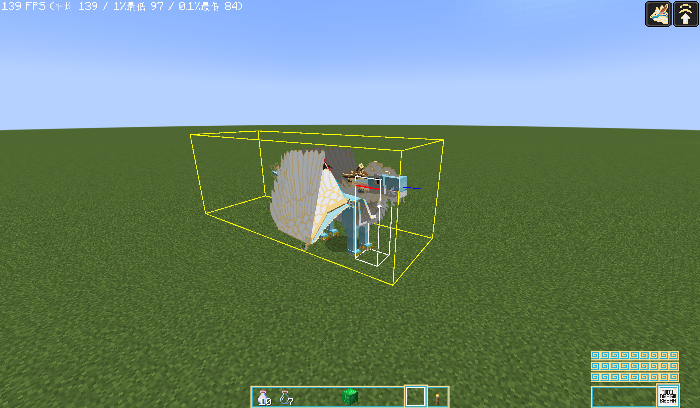
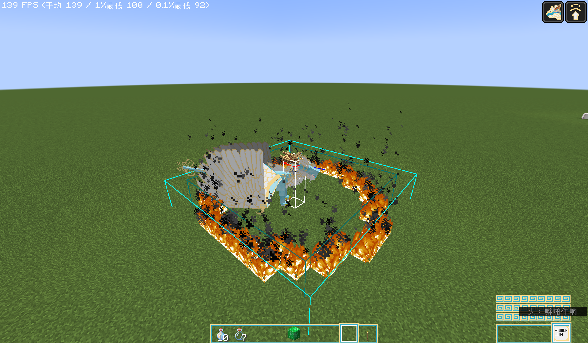
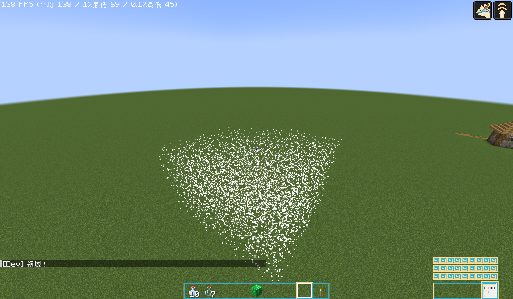

# Target Types (`target_type`)

> Applies to: Additional Abilities for DS `2.0.0` · Dragon Survival `≥ 2.0.68`
> Location: `actions[].target_selection.target_type`

A target type decides **who the ability selects**. It is written inside `actions[].target_selection`, with
`target_type` sitting at the **same level** as `applied_effects`:

```jsonc
"target_selection": {
  "target_type": "additional_abilities:xxx",
  "applied_effects": { /* what to do with the selection */ },
  /* ← this target type's own fields go here too */
}
```

---

## Target types added by this mod

| `target_type` | In one sentence | Built-in counterpart |
|---|---|---|
| `additional_abilities:anti_dragon_breath` | A dragon breath cone, but extending **behind** the caster | `dragonsurvival:dragon_breath` |
| `additional_abilities:annulus` | A ring — a disc with the inner circle hollowed out | `dragonsurvival:disc` |
| `additional_abilities:domain` | A **domain** — a persistent area left at the casting spot that keeps acting on an interval | none (every built-in target type is one-shot) |

---

## 1. `additional_abilities:anti_dragon_breath` — Reverse Dragon Breath Cone

**In one sentence**: exactly the same as Dragon Survival's built-in `dragonsurvival:dragon_breath`, except
the cone extends **behind** the caster.



### Fields

| Field | Type | Required | Default | Notes |
|---|---|---|---|---|
| `applied_effects` | object | ✅ | — | Common to every Dragon Survival target type: write `entity_effect[]` or `block_effect[]`, plus `target_conditions` / `targeting_mode` / `is_harmful` |
| `range_multiplier` | level value | ✅ | — | **Multiplied** with the caster's `dragonsurvival:dragon_breath_range` attribute to give the actual range |

The fields are identical, word for word, to `dragonsurvival:dragon_breath`. **Swap the `target_type` and any
breath ability becomes a "spray backwards" ability.**

### Example

```json
{
  "target_selection": {
    "target_type": "additional_abilities:anti_dragon_breath",
    "range_multiplier": 1.0,
    "applied_effects": {
      "entity_effect": [
        {
          "effect_type": "dragonsurvival:potion",
          "potion": {
            "amplifier": 0.0,
            "duration": 60.0,
            "effects": "minecraft:glowing",
            "probability": 1.0
          }
        }
      ],
      "targeting_mode": "non_allies"
    }
  },
  "trigger_rate": 10.0
}
```

### What the selection box looks like

Taking "eye height 1.62, scale 1, range 4, facing +X horizontally" as an example:

| Target type | X range | Y range | Z range |
|---|---|---|---|
| `dragonsurvival:dragon_breath` | -1 ~ 4 | 0.81 ~ 2.43 | -1 ~ 1 |
| `additional_abilities:anti_dragon_breath` | **-4 ~ 1** | 0.81 ~ 2.43 | -1 ~ 1 |

Backwards and sideways are reversed, and **the box does not shift downwards** — the body-thickness portion
stays on the body's side.

### Things to know

- **`target_type` is the only switch.** The rest of the ability (`sound`, `animations`, `trigger_rate`,
  `applied_effects`) needs no changes at all to become "reversed".
- **The block branch's facing argument is unchanged from Dragon Survival's breath**: the `direction` handed
  to block effects is "the nearest axis from the eye's world position" and has nothing to do with where you
  are looking. Keep that in mind if your block effect depends on it.
- **Who can be hit is decided by `applied_effects.targeting_mode`**, not by the target type itself.
  Use `non_allies` or `enemies` to hit only hostiles, or `allies_and_self` to buff your own side.
- The sidebar description is already localised in this mod:
  - block branch → `Targets a %s block cone behind you`
  - entity branch → `Targets %s in a %s block cone behind you`

> A runnable reference lives in
> `data/additional_abilities/dragonsurvival/dragon_ability/test_anti_dragon_breath.json`
> (affected entities glow and white particles fill the box, so the reversed volume is visible to the eye).
> That test ability is not attached to any species — grant it with `/dragon-ability add`.

---

## 2. `additional_abilities:annulus` — Ring

**In one sentence**: the same idea as Dragon Survival's built-in `dragonsurvival:disc`, but with the
**inner circle hollowed out** — only the band between the inner and outer radius is selected.



### Fields

| Field | Type | Required | Default | Notes |
|---|---|---|---|---|
| `applied_effects` | object | ✅ | — | Common to every Dragon Survival target type: write `entity_effect[]` or `block_effect[]`, plus `target_conditions` / `targeting_mode` / `is_harmful` |
| `inner_radius` | level value | ✅ | — | Inner radius in blocks. **Nothing inside this radius is selected** |
| `width` | level value | ✅ | — | Ring width in blocks, **added radially on top of the inner radius** |
| `height` | level value | ❌ | `1` | Thickness in blocks |
| `height_starts_below` | boolean | ❌ | `false` | `false` → Y range `[y, y + height]`; `true` → `[y - 1, y + height - 1]` |

`inner_radius`, `width` and `height` all accept every `LevelBasedValue` form
(`linear` / `lookup` / constant …), for example
`"width": { "type": "minecraft:linear", "base": 2.0, "per_level_above_first": 0.5 }`.

### Area of effect

```
origin = the caster's foot position (same as disc)
r_in   = inner_radius
r_out  = inner_radius + width          ← width is added radially, it is not the outer radius
Bounding box (XZ) = origin ± r_out
Y range           = height_starts_below ? [y - 1, y + height - 1] : [y, y + height]
Hit condition: horizontal distance d satisfies  r_in ≤ d ≤ r_out  (inclusive)
```

### Example

```json
{
  "target_selection": {
    "target_type": "additional_abilities:annulus",
    "inner_radius": 5,
    "width": 1.0,
    "height": 3.0,
    "height_starts_below": true,
    "applied_effects": {
      "entity_effect": [
        {
          "effect_type": "dragonsurvival:potion",
          "potion": { "amplifier": 0.0, "duration": 60.0, "effects": "minecraft:glowing", "probability": 1.0 }
        }
      ],
      "targeting_mode": "all"
    }
  },
  "trigger_rate": 10.0
}
```

The config above selects a band from radius 5 to 6, three blocks thick starting one block below the feet.

### Things to know

- **It selects a ring, not a disc.** Everything inside `inner_radius` is untouched — that is precisely the
  value it adds over `disc` (for example a "halo" that only hits the surroundings while leaving a safe spot
  under your own feet).
- **Only the horizontal distance is compared**; the vertical extent is entirely governed by `height` and
  `height_starts_below`. It is therefore a **cylindrical shell** — a ring times a thickness — not a
  three-dimensional spherical shell. That is also why `height` can exist as a separate parameter.
- **The iteration count does not shrink just because the inner circle is empty.** After the bounding-box
  pre-filter, `(2 × r_out + 1)² × height` block positions are still visited. When `inner_radius` is large,
  raise `trigger_rate` accordingly (5 or higher is advisable) or the per-tick cost will be noticeable.
- **Boundary testing uses the centre-point method**: blocks use their cell centre
  `(x + 0.5, z + 0.5)`, entities use `position()` (foot centre). The result is predictable and reproducible,
  and no block ever looks like it was "eaten" at the edge.
- **The sidebar description keeps two decimals** (Dragon Survival's `disc` truncates with `(int)`), so a
  fractional radius is not displayed as a whole number. The range shown is the **outer radius**
  (the far edge of the band).
- **The block branch passes `direction` as `null`** — consistent with Dragon Survival's `area` / `disc`
  (only `looking_at` passes a real hit-face orientation). Block effects that depend on it need their own
  fallback.
- **F3+B draws two boxes**: cyan for the outer bound, dark cyan for the inner (hollowed) bound.
  This mod renders that pair itself — Dragon Survival's `ClientDragonRenderer#renderAbilityHitbox` is a
  hard-coded branch chain with no extension point.
- Who can be hit is again decided by `applied_effects.targeting_mode`, not by the target type itself.

> A runnable reference lives in
> `data/additional_abilities/dragonsurvival/dragon_ability/test_annulus.json`
> (inner radius 5 / width 1 / thickness 3 starting one block below the feet; affected entities glow and are
> wrapped in dragon breath particles, while the block side spawns end-rod particles and sets fire).
> That test ability is not attached to any species — grant it with `/dragon-ability add`.

---

## 3. `additional_abilities:domain` — Domain

**In one sentence**: the cast **leaves a persistent area behind at the casting spot**; every
`apply_interval` ticks it replays `applied_effects` onto the entities / blocks inside, and it disappears
once `duration` runs out.



### How it differs from every built-in target type

All five built-ins (`self` / `area` / `disc` / `looking_at` / `dragon_breath`) are **one-shot**: the instant
`apply` runs they pick their targets, apply their effects, and **leave nothing behind**. That is why Dragon
Survival cannot express "leave an area at the casting spot that keeps acting for a while" — this target type
fills exactly that gap, and it is the only target type in this mod with a **life cycle**.

### Why it is a target type

The execution chain is `actions[] → target_selection → applied_effects`, and `applied_effects`
(`Either<block_effect[], entity_effect[]>`) exists **only on the `target_selection` level**.
Making this a **target type** is the only way to reuse that field verbatim — and that is what makes
**all 33 built-in entity effects and all built-in block effects** (`modifier` / `potion` / `run_function` /
`damage` / `summon_entity` / `particle` / `fire` / `conversion` / `extinguish` …) work with zero
adaptation, automatically including any effect added upstream. An activation type cannot see
`applied_effects` at all and would have to redefine the whole effect schema.

### Fields

| Field | Type | Required | Default | Notes |
|---|---|---|---|---|
| `applied_effects` | object | ✅ | — | Shared by every target type: `entity_effect[]` **or** `block_effect[]`, plus `target_conditions` / `targeting_mode` / `is_harmful` |
| `radius` | level value | ✅ | — | Radius in blocks. **Sphere / cube** = half-extent per axis; **cylinder** = horizontal radius |
| `duration` | level value | ✅ | — | Domain lifetime in ticks (20 = 1 second) |
| `shape` | enum | ❌ | `sphere` | `sphere` / `cube` / `cylinder` |
| `height` | level value | ❌ | = `radius` | Cylinder only: extra blocks **above** the anchor |
| `height_starts_below` | boolean | ❌ | `false` | Cylinder only: `false` → Y range `[y, y + height]`; `true` → `[y - 1, y + height - 1]` |
| `apply_interval` | level value | ❌ | `20` | Tick once every N ticks |
| `anchor` | enum | ❌ | `casting_position` | `casting_position` (fixed **forever**) / `caster` (follows the caster) |
| `max_domains` | int | ❌ | `1` | Upper bound on **how many casts'** domains may coexist for the same ability; the oldest is evicted |
| `remove_effects_on_end` | boolean | ❌ | `false` | Call `remove` once on the entities inside before the domain vanishes |

`radius` / `duration` / `height` / `apply_interval` all support the full `LevelBasedValue` syntax
(`linear` / `lookup` / constant …).

### Area of effect

```
origin = the anchor (with casting_position: the caster's foot position at the first settlement)

sphere   : box = origin ± radius (equal on all three axes), then refined by 3D distance ≤ radius
           (this cuts the 8 corners of the box)
cube     : box = origin ± radius, no refinement (matches the built-in area semantics)
cylinder : box = origin ± radius on XZ; the Y range matches disc / annulus
           height_starts_below=false → [y, y + height]  (height + 1 cells)
           height_starts_below=true  → [y - 1, y + height - 1]
           refinement: horizontal distance ≤ radius (cuts the four horizontal corners)
```

`radius` means "half-extent" for all three shapes, so switching shapes never creates an illusion about the
size. Sampling matches the other target types: **blocks use their cell centre** `(x+0.5, y+0.5, z+0.5)`,
**entities use `position()`** (foot centre).

### Timeline

```
the frame the cast finishes (currentTick == cast_time)
 ├─ the domain is created: anchor = dragon.position() at that moment; radius / shape / interval /
 │  duration / effect sets are all frozen
 ├─ it settles once immediately — effects land right away, without waiting for the first apply_interval
 └─ with simple, stopCasting then fires at once and the caster is free to move
afterwards it settles once every apply_interval ticks
when duration runs out the domain vanishes (calling remove on the entities inside first, if
remove_effects_on_end: true)
```

### Example 1 — `simple`, the primary use case

```json
{
  "actions": [
    {
      "target_selection": {
        "target_type": "additional_abilities:domain",
        "radius": { "type": "minecraft:linear", "base": 4.0, "per_level_above_first": 1.0 },
        "duration": { "type": "minecraft:linear", "base": 200.0, "per_level_above_first": 100.0 },
        "apply_interval": 20.0,
        "shape": "sphere",
        "anchor": "casting_position",
        "applied_effects": {
          "entity_effect": [
            {
              "effect_type": "dragonsurvival:potion",
              "potion": { "amplifier": 0.0, "duration": 60.0, "effects": "minecraft:regeneration", "probability": 1.0 }
            }
          ],
          "targeting_mode": "allies_and_self"
        }
      }
    }
  ],
  "activation": {
    "activation_type": "dragonsurvival:simple",
    "cast_time": 20.0,
    "cooldown": 400.0,
    "initial_mana_cost": 3.0
  }
}
```

### Example 2 — `channeled`, maintaining the domain while channelling

Swap the `activation` for a channel and the semantics become "**maintained while channelling, plus a
lingering
`duration` afterwards**":

```json
"activation": {
  "activation_type": "dragonsurvival:channeled",
  "cast_time": 20.0,
  "max_duration": 200.0,
  "cooldown": 400.0,
  "initial_mana_cost": 3.0,
  "continuous_mana_cost": { "type": "ticking", "amount": 0.02 }
}
```

A `channeled` activation calls this target type once every `trigger_rate` ticks, and those calls are
recognised as **belonging to the same cast**: they only "renew" the domain and merge effects in —
**the anchor is not moved and the settlement cadence is not reset**. Consequences:

- the anchor is fixed at the position of the frame channelling **officially begins**, and does not drift
  with you while you channel;
- effect settlement keeps following `apply_interval` strictly, decoupled from `trigger_rate`
  (**two levels of throttling**);
- after you release the key / run out of mana / hit `max_duration`, the domain keeps living for another
  `duration` before it fades;
- if you start channelling again somewhere else, that counts as a **new cast**: the old domain is wound
  down and a new one is created at the new position.

### One cast = one domain (multiple actions merge)

`applied_effects` is an `Either` — a **single `target_selection` cannot hold entity effects and block
effects at the same time**. To have one domain affect both, you write two `target_selection` entries that
both point at this target type. They share the same cast, so the second one **merges into** the first
domain: **one domain, one anchor and one timer, two effect sets** — instead of two domains replacing
each other.

> When merging, **shape / radius / duration / interval follow the first action**; later actions only
> contribute their `applied_effects`. Keep those parameters identical across domain actions to avoid
> confusion.

### Things to know

- ⚠️ **`cast_time` must be ≥ 1** (with `simple`). Dragon Survival's `ActionContainer#tick` throttles with
  `actualTick = currentTick - cast_time`; with `cast_time = 0` the first settlement has `actualTick = 1`,
  so as soon as `trigger_rate > 1` you get `1 % rate != 0` and **`apply` never runs — the domain is never
  created**. (With `channeled` the same config merely delays the first settlement by up to `trigger_rate`
  ticks instead of never firing.)
- **Not persisted**: a domain lives in memory only and vanishes on server restart. This is deliberate —
  serialising Dragon Survival effect configs into the save would be brittle across Dragon Survival
  versions, and a domain only lives for seconds to minutes anyway.
- **When the caster is offline or in another dimension**: settlement is skipped but the timer keeps
  running. Nothing breaks, and there is no hidden "the domain resumes once the caster returns" pause.
- **`should_remove_automatically` measures something else**: Dragon Survival's flag on duration-based
  effects compares the target's distance to the **caster** against `getDistance()`, while this target type
  normally anchors at the casting spot. Use `remove_effects_on_end: true` when you want "leaving the
  domain ends the effect".
- **Block-branch iteration count**: the `cube` / `sphere` box holds `(2r+1)³` positions, and the spherical
  refinement leaves roughly half of them. When `radius` grows, raise `apply_interval` too (the default of
  20 is already conservative; going below 10 is not advised). The entity branch is unaffected (a single
  AABB query).
- **The block branch passes `direction` as `null`** — consistent with Dragon Survival's `area` / `disc`
  (a domain anchor has no "hit face").
- **Who gets affected** is decided by `applied_effects.targeting_mode`, not by the target type itself
  (same as every other Dragon Survival target type).
- **Visuals**: this target type does not render anything of its own. Put the visible feedback in the
  ability's own `particle` effects — because they are replayed every `apply_interval`, they naturally
  form a continuous particle field.
- **F3+B draws an orange box** anchored under the player's feet, showing "how large a domain casting right
  now would leave behind". A sphere cuts the box's 8 corners and a cylinder its four horizontal corners,
  so the wireframe is slightly larger than the real hit area — that is expected.

> A runnable reference lives in
> `data/additional_abilities/dragonsurvival/dragon_ability/test_domain.json`
> (sphere / radius 4 / 200-tick duration / settles every 20 ticks; the entity side grants Regeneration to
> allies and yourself plus dragon breath particles, the block side sprinkles end-rod particles — it is
> also a live example of the multi-action merge). That test ability is not attached to any species —
> grant it with `/dragon-ability add`.
