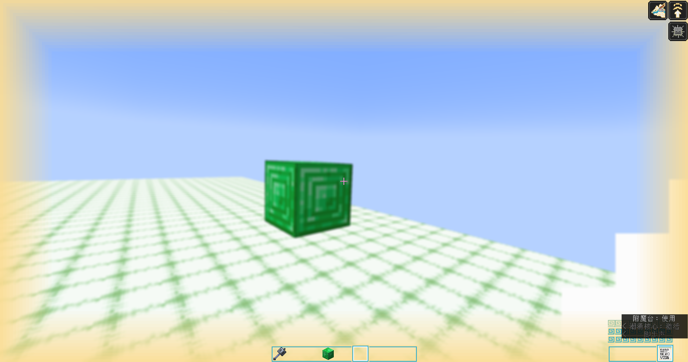

# 实体效果（entity_effect）

> 适用：Additional Abilities for DS `2.0.0` · Dragon Survival `≥ 2.0.68`
> 相关：`actions[].target_selection.applied_effects.entity_effect[]`

实体效果写在 `applied_effects.entity_effect[]` 数组里，每个元素用 `effect_type` 指定类型，
该类型自己的字段与 `effect_type` **平级**：

```jsonc
"applied_effects": {
  "entity_effect": [
    { "effect_type": "additional_abilities:xxx", /* ← 该类型自己的字段写在这一层 */ }
  ],
  "targeting_mode": "non_allies"
}
```

下面三个 `effect_type` 是本模组新增的。

---

## 一、`additional_abilities:damage_reflection` 伤害反震

**一句话**：拥有者受到伤害时，把伤害按比例「炸」回身边一圈敌人。

### 字段

| 字段 | 类型 | 必填 | 默认 | 说明 |
|---|---|---|---|---|
| `reflection_percentage` | 等级数值 | ✅ | — | 反震比例，**0~1 小数**。负数按 0 处理；超过 1 会放大伤害，慎用 |
| `reflection_range` | 等级数值 | ✅ | — | 作用半径（格），计算后向下取整；≤0 时本效果不生效 |
| `use_same_damage_type` | 布尔 | ❌ | `false` | `false` → 用 `additional_abilities:counter_shock`（震伤）；`true` → 沿用打你的那种伤害类型 |

### 示例

```json
{
  "actions": [
    {
      "target_selection": {
        "applied_effects": {
          "entity_effect": [
            {
              "effect_type": "additional_abilities:damage_reflection",
              "reflection_percentage": { "type": "minecraft:linear", "base": 0.25, "per_level_above_first": 0.05 },
              "reflection_range": { "type": "minecraft:linear", "base": 8.0, "per_level_above_first": 1.0 },
              "use_same_damage_type": false
            }
          ],
          "targeting_mode": "all"
        },
        "target_type": "dragonsurvival:self"
      }
    }
  ],
  "activation": { "activation_type": "dragonsurvival:passive" }
}
```

### 用法要点

- **只认玩家**。目标不是玩家时整个效果直接跳过，所以 `target_type` 基本只能写 `dragonsurvival:self`。
- **反震的是「一圈人」，不是「打你的那个」**。以受击玩家为中心、边长 `reflection_range` 的立方体内，
  **所有敌对生物各吃一次全额反震**。敌对判定沿用 DS 的 `enemies` 逻辑（含 PvP 开关与队伍判断）。
  想要「荆棘」那种只反给攻击者的手感，本效果做不到，别把范围开太大以免误伤。
- **基数取减免前的原始伤害**。护甲、抗性 V 把实际扣血压到 0 也照样按原始伤害反震。
- **反震伤害不会再次被反震**。三重守卫：伤害来源是自己 / 伤害类型是震伤 / 结算期间重入标志。
  双方都带这个技能也不会互相刷屏。
- **效果不是常驻 buff，要靠刷新维持**。写入的条目只有 **100 刻（5 秒）** 有效期：
  - **被动技能**：`trigger_rate` 的节拍间隔必须明显小于 100 刻，否则反震会一闪一闪；
  - **主动技能**：施法期间会被周期刷新，停手后最多残留 5 秒后自动消失。
- **多个技能会各自独立结算**。同一个玩家身上有两个带反震的技能，就是各按自己的比例各震一次，伤害叠加。

---

## 二、`additional_abilities:percentaged_damage` 百分比伤害

**一句话**：按目标生命值的百分比造成伤害 —— DS 内置 `dragonsurvival:damage` 的「按比例」版本。

### 字段

| 字段 | 类型 | 必填 | 默认 | 说明 |
|---|---|---|---|---|
| `damage_type` | 伤害类型 | ✅ | — | 与 `dragonsurvival:damage` 同字段。可写注册 id 字符串，如 `"minecraft:magic"`、`"additional_abilities:counter_shock"` |
| `percentage` | 等级数值 | ✅ | — | 生命值百分比，**0~1 小数**，负数按 0 |
| `calculate_type` | 枚举 | ✅ | — | `max_health` = 按**最大**生命值；`current_health` = 按**当前**生命值 |
| `scale` | 属性 | ❌ | `dragonsurvival:dragon_ability_damage` | 乘算用的属性（默认即「龙之技能伤害」） |
| `expression` | 字符串 | ❌ | `"amount * scale"` | 最终伤害的表达式，可用变量见下 |
| `use_claw` | 布尔 | ❌ | `false` | 是否临时换成龙爪剑的攻击判定（同 `damage`） |

表达式里可用的两个变量：

| 变量 | 含义 |
|---|---|
| `amount` | 基础伤害 = `percentage` × 目标的（最大 / 当前）生命值 |
| `scale` | 施法者身上 `scale` 字段所指属性的当前值 |

### 示例

```json
{
  "effect_type": "additional_abilities:percentaged_damage",
  "damage_type": "minecraft:magic",
  "percentage": { "type": "minecraft:linear", "base": 0.05, "per_level_above_first": 0.02 },
  "calculate_type": "max_health",
  "expression": "amount"
}
```

### 用法要点

- **只作用于生物**（`LivingEntity`）。矿车、掉落物、盔甲架这类非生物目标直接跳过。
- 默认最终伤害 = `percentage` × 目标生命值 × 施法者的 `dragon_ability_damage` 属性。
  **想让它只吃百分比、不吃属性加成，就把 `expression` 写成 `"amount"`。**
- 百分比是**每次结算都按目标当时的生命值重算**：
  - `current_health` 打残血目标伤害极低，适合「处决」思路；
  - `max_health` 对高血量目标（Boss、铁傀儡）非常暴力，注意平衡。
- 目标生命值取 `getMaxHealth()`，**包含属性修饰符**，所以给敌人上过加血 buff 时反伤会同步变高。

---

## 三、`additional_abilities:simple_screen_vision` 简单屏幕视觉

**一句话**：给对方玩家的画面上叠加镜头抖动、画面模糊或边缘遮罩。



### 字段

| 字段 | 类型 | 必填 | 默认 | 说明 |
|---|---|---|---|---|
| `base` | 对象 | ✅ | — | 身份与时长；**结构对齐龙生「时长实例族」效果**（`modifier` / `glow` / `block_vision` 等） |
| `base.id` | 资源位置 | ✅ | — | 本效果的标识，如 `additional_abilities:screen_vision_shake` |
| `base.duration` | 等级数值 | ❌ | 60 刻 | 持续时长，单位 **tick**（1 秒 = 20）。计算后向下取整；**省略或算得负数**取 60 刻兜底，显式算出 `0` 则无效 |
| `type` | 枚举 | ✅ | — | `shake` 镜头抖动 / `blur` 画面模糊 / `edge_light` 边缘遮罩 |
| `amplifier` | 等级数值 | ❌ | `1.0` | 强度倍率；对 `edge_light` 即**遮罩不透明度**（`> 1` 按 1 算）。语义见下表 |
| `size` | 等级数值 | ❌ | `0.15` | **仅 `edge_light`**：遮罩边缘厚度，占屏幕**短边**的比例，钳制 0~0.5 |
| `color` | 颜色 | ❌ | `white` | **仅 `edge_light`**：遮罩颜色，原版颜色名或 `#RRGGBB`（**不含 alpha**，要半透明请调 `amplifier`） |
| `probability` | 等级数值 | ❌ | `1.0` | 生效概率，**每次触发独立判定**（与 DS 内置药水效果同约定） |

`base` 与龙生 `modifier` / `damage_modification` 等效果共用同一套 `DurationInstanceBase`，完整字段为
`id`（必填）、`duration`、`should_remove_automatically`、`early_removal_condition`、`custom_icon`、`is_hidden`。
⚠️ **本效果只读其中的 `id` 与 `duration`** —— 其余四个是龙生「把效果实例存进实体附件、逐刻 tick」那套机制的开关，
而本效果的画面状态由接收端本地倒计时自管，没有实例需要 tick，所以这四个字段**能被接受、但没有运行时语义**。
照单收下是为了与龙生的 JSON 形态保持一致，并留出将来升级的余地。

### 强度对照

| `type` | `amplifier` 的语义 | 建议范围 |
|---|---|---|
| `shake` | `1.0` ≈ 镜头 roll 最大偏移 **1.5°** | 0.5 ~ 5 |
| `blur` | `1.0` = 模糊半径 **1 像素**，**上限 20**（超过按 20 算） | 1 ~ 20 |
| `edge_light` | `1.0` = 遮罩完全不透明（**`amplifier` 在这里读作"不透明度"**） | 0.2 ~ 1 |

### 示例（一次施法同时给三种视觉）

```json
"entity_effect": [
  {
    "effect_type": "additional_abilities:simple_screen_vision",
    "base": {
      "id": "additional_abilities:screen_vision_blur",
      "duration": { "type": "minecraft:linear", "base": 40.0, "per_level_above_first": 20.0 }
    },
    "type": "blur",
    "amplifier": 5,
    "probability": 1.0
  },
  {
    "effect_type": "additional_abilities:simple_screen_vision",
    "base": {
      "id": "additional_abilities:screen_vision_shake",
      "duration": { "type": "minecraft:linear", "base": 40.0, "per_level_above_first": 20.0 }
    },
    "type": "shake",
    "amplifier": 3.0,
    "probability": 1.0
  },
  {
    "effect_type": "additional_abilities:simple_screen_vision",
    "base": {
      "id": "additional_abilities:screen_vision_edge_light",
      "duration": { "type": "minecraft:linear", "base": 60.0, "per_level_above_first": 20.0 }
    },
    "type": "edge_light",
    "amplifier": 0.6,
    "size": 0.25,
    "color": "gold",
    "probability": 1.0
  }
]
```

### 用法要点

- **只对玩家生效**，非玩家目标（哪怕是生物）直接跳过。
- **零副作用**：不改伤害、不改移动、不改属性，纯粹是接收端的画面表现。
- `blur` **只糊世界画面，不糊 GUI** —— 血条、物品栏、聊天框照常清晰。
- **多种视觉可以并存**，同一次施法里同时下发互不吞没。
- `edge_light` 的遮罩**垫在 HUD 之下**（血条、物品栏、聊天框都在遮罩之上），且绘制时机晚于 `blur`
  的后处理链 —— **遮罩本身不会被糊掉**，两者可以同时生效。
- `edge_light` 的 `size` 以**屏幕短边**为基准，四条边厚度一致；把 `color` 写成 `black` 就从"亮边"
  变成压暗的"暗角"（同一套渲染，只换色值）。
- ⚠️ `size` 与 `color` 是 `edge_light` 专有字段：写在 `shake` / `blur` 的条目里**不报错也不生效**
  （刻意不做硬校验 —— codec 抛异常会直接废掉整个数据包，代价远大于收益）。
- ⚠️ 同理，`base` 里的 `should_remove_automatically` / `early_removal_condition` / `custom_icon` / `is_hidden`
  写了**也不生效**（原因见上面的字段说明）。其中 `custom_icon` 与 `is_hidden` 在龙生里管的是
  「技能信息侧栏显示哪张图标」与「是否在该栏隐藏」，本效果没有侧栏条目，调它们不会有任何可见变化。
- ⚠️ `base.id` 请保持唯一，且**不要照抄** `dragonsurvival:` 下的现成 id：龙生做「施法者超距则提前移除」时
  会拿技能里各效果的 id 比对，撞名可能误伤同名的龙生效果实例。命名空间已天然隔离，按用途正常命名
  （如 `additional_abilities:screen_vision_shake`）不会踩到；同一个 id **跨技能复用**则是允许的
  （龙生自己也这么用，例如 `good_mana_condition`）。
- **重复下发是安全的**，不会无限延长也不会无限加强：同类型再次触发时时长取较大值、强度取较大值。
  因此被动技能高频刷新不会出问题。
- 服务端有**节流**：同一玩家、同一视觉类型，5 刻内且**参数完全没变**（强度 / 尺寸 / 颜色都一样）就不再发包。任一参数变化都会放行。
- 表现细节：淡入 5 刻、淡出 10 刻，不会「啪」一下硬切；抖动的相位由本地刻驱动，**与帧率无关**。
- **想立刻清掉**（调试用）：`/additional-abilities simple-screen-vision clear <targets>`，详见 [06-调试与查询指令.md](06-调试与查询指令.md)。
  注意被动技能下一拍会重新下发，清空只对当下有效。
