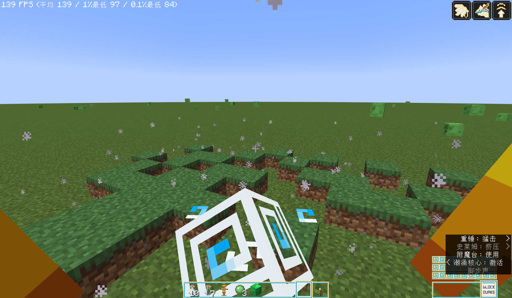
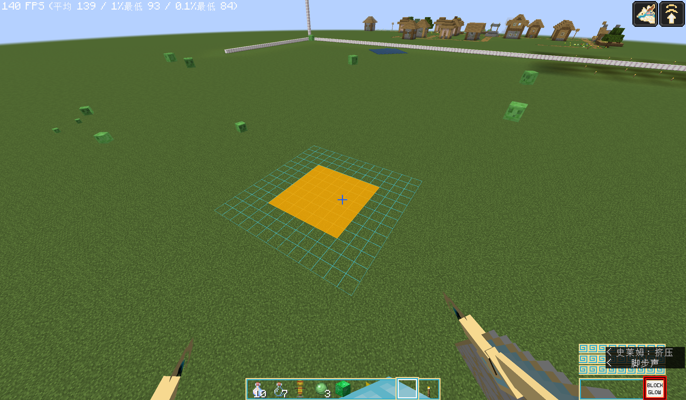

# 方块效果（block_effect）

> 适用：Additional Abilities for DS `2.0.0` · Dragon Survival `≥ 2.0.68`
> 相关：`actions[].target_selection.applied_effects.block_effect[]`

方块效果写在 `applied_effects.block_effect[]` 数组里，每个元素用 `effect_type` 指定类型，
该类型自己的字段与 `effect_type` **平级**：

```jsonc
"applied_effects": {
  "block_effect": [
    { "effect_type": "additional_abilities:block_quake", /* ← 字段写在这一层 */ }
  ]
}
```

---

## `additional_abilities:block_quake` 方块震动

**一句话**：让被选中的方块像被砸地掀起一样跳一下，再落回原位。



### 字段

| 字段 | 类型 | 必填 | 默认 | 说明 |
|---|---|---|---|---|
| `amplifier` | 等级数值 | ❌ | `0.5` | 高度倍率，见下方换算 |
| `probability` | 等级数值 | ❌ | `1.0` | 生效概率，**每个方块独立判定** |
| `valid_blocks` | 方块谓词 | ❌ | 全匹配 | 与 DS 其它方块效果同格式 |
| `sound` | 音效 id | ❌ | 无声 | 跃起时播放的音效。直接写注册 id 字符串，如 `"minecraft:item.mace.smash_ground"` |

### 高度换算

```
跃起高度（格） = min(3.0, 0.5 × amplifier)
```

| `amplifier` | 0.5 | 1.0 | 2.0 | 6.0 及以上 |
|---|---|---|---|---|
| 高度 | 0.25 格 | 0.5 格 | 1.0 格 | 3.0 格（封顶） |

跳跃时长随高度以 √ 关系增长（跳得越高耗时越长），自动钳制在 **6 ~ 24 刻**，不用手调。

### 示例

```json
"block_effect": [
  {
    "effect_type": "additional_abilities:block_quake",
    "amplifier": { "type": "minecraft:linear", "base": 0.5, "per_level_above_first": 0.25 },
    "probability": 0.35,
    "valid_blocks": { "type": "minecraft:matching_block_tag", "tag": "minecraft:dirt" },
    "sound": "minecraft:item.mace.smash_ground"
  }
]
```

### 用法要点

- **纯视觉，不改世界**。跃起的方块是客户端本地生成的假身，**不参与碰撞、不进存档、不掉落**，
  也没有邻接更新与光照变化。放心在大范围里用。
- **有筛选链**，被滤掉的方块不会动（顺序即开销顺序）：
  1. 概率判定；
  2. `valid_blocks` 谓词；
  3. 排除空气；
  4. **只保留满碰撞方块** —— 台阶、楼梯、火把、草、流体被抬起一整格时观感是错的，一并滤掉；
  5. **表层判定** —— 上方有遮挡（说明方块被埋住）、或上方是流体，都跳过。
- 第 4、5 条意味着：**水下与地下的方块不会跳**。这是有意的观感保护，不是 bug。
- `sound` 与 DS 技能 JSON 的 `activation.sound` 写法一致，直接写音效注册 id 即可；
  自定义音效只要已注册进 `minecraft:sound_event` 也能填。播放细节：
  - **每次技能动作只响一次**，声源取该批方块的**几何中心** —— 一次范围震动往往同时抬起几十个方块，
    逐方块播放等于几十个音源叠加，听感是爆音而不是「一下砸地」；
  - 音量 / 音高固定为原版默认的 `1.0`（可听半径约 16 格），**不随 `amplifier` 变化**；
  - 服务端广播，**施法者本人也听得到**。
- **有内建限流**，不用担心高频 `trigger_rate` 把方块抖成鬼畜：
  - **位置冷却**：同一坐标 10 刻内只震一次；
  - 同一刻的触发会聚合成尽可能少的网络包，并按包围盒半径只发给附近的玩家。
- 本效果只动「方块的外形」，**不产生伤害**。要配伤害请另加 `dragonsurvival:damage` 之类的实体效果，
  并注意用**另一个 action**（实体效果与方块效果不能写在同一个 `applied_effects` 里）。

---

## `additional_abilities:extinguish` 熄灭

**一句话**：把被选中的方块上**正在烧的东西**扑灭 —— DS 内置 `dragonsurvival:fire` 的反向版。

### 字段

| 字段 | 类型 | 必填 | 默认 | 说明 |
|---|---|---|---|---|
| `extinguish_probability` | 等级数值 | ❌ | `1.0` | **只作用于火焰方块**（`fire` / `soul_fire`）；营火与蜡烛无条件熄灭 |

### 能扑灭什么

判定顺序与原版喷溅水瓶的 `ThrownPotion#dowseFire` 完全一致，三者互斥（命中即返回）：

| 顺序 | 目标 | 行为 |
|---|---|---|
| 1 | 火焰：`minecraft:fire` / `minecraft:soul_fire`（`#minecraft:fire` 标签） | 按 `extinguish_probability` 移除方块（**不掉落**） |
| 2 | 点燃的蜡烛 / 蜡烛蛋糕 | 置 `lit=false`，烟雾粒子 + `CANDLE_EXTINGUISH` 音效 |
| 3 | 点燃的营火 / 灵魂营火 | 置 `lit=false`，停止烹饪（`CampfireBlockEntity#dowse`）+ `FIRE_EXTINGUISH` 音效 |

### 与 `dragonsurvival:fire` 的镜像关系

| `dragonsurvival:fire` 的分支 | `extinguish` 的对应 |
|---|---|
| TNT → 引爆 | **无** —— 已引燃的 TNT 无法取消 |
| 未点燃营火 → 点燃 | 已点燃营火 → 熄灭 |
| `snowy` 方块 → 除雪 | **无** —— 反向「加雪」与熄灭无关 |
| 空气位 + 概率 → 放火 | 火焰方块 + 概率 → 移除 |
| （无） | 蜡烛 / 蜡烛蛋糕 → 熄灭 **（本效果新增的一支）** |

结构同样对称：**只有「放火 / 灭火」这一支吃概率**，特殊分支不吃。

### 示例

```json
"block_effect": [
  {
    "effect_type": "additional_abilities:extinguish",
    "extinguish_probability": 1.0
  }
]
```

### 用法要点

- **原版没有「灭火 API」**。MC 1.21.1 里不存在能直接扑灭火焰方块的方法（`FireBlock` / `BaseFireBlock`
  都没有 `extinguish`），所以本效果照抄原版喷溅水瓶的处理方式，音效、粒子与 `BLOCK_CHANGE` 游戏事件都一致。
- 火焰用 `destroyBlock(pos, false, dragon)` 移除，**不掉落**（火焰本就没有战利品表）。
- **`direction` 不参与任何判定**，因此不受「`direction` 多为 null」的影响。
- 概率**不足 100%** 时才会在侧边栏追加「生效概率 x%」。
- 与内置效果的分工：`dragonsurvival:block_break` 只能拆火焰且无音效；`dragonsurvival:conversion` 只能按方块状态
  做一一映射（如营火→未点燃营火）。要「把一片区域的火全灭了」用本效果，一次覆盖火焰、营火与蜡烛。

---

## `additional_abilities:glow` 方块发光

**一句话**：让被选中的方块**发光** —— 视距内的**任何玩家**看到的都是同一处、同色、同时长的效果。



### 字段

| 字段 | 类型 | 必填 | 默认 | 说明 |
|---|---|---|---|---|
| `color` | 颜色 | ✅ | — | 原版 `TextColor`：16 个颜色名，或 `#RRGGBB`，见下 |
| `alpha` | `0.0` ~ `1.0` | ❌ | `1.0` | 不透明度。为 0 等于不可见，会被直接跳过 |
| `display_type` | 枚举 | ❌ | `outline` | `outline`（线框）/ `simple_shader`（整块染色） |
| `duration` | 等级数值 | ❌ | `60`（3 秒） | 发光时长（刻），自动钳制在 **1 ~ 1200** |
| `probability` | 等级数值 | ❌ | `1.0` | 生效概率，**每个方块独立判定** |
| `valid_blocks` | 方块谓词 | ❌ | 全匹配 | 与 DS 其它方块效果同格式 |
| `hide_occluded` | 布尔 | ❌ | `true` | 是否剔除被完全遮挡的方块。**只对 `simple_shader` 生效** |

### 颜色怎么写

| 写法 | 例子 |
|---|---|
| 颜色名（16 个，全小写） | `"aqua"` / `"dark_purple"` / `"light_purple"` / `"gold"` … |
| 十六进制 | `"#3FD9FF"` |

颜色名共 16 个：`black` `dark_blue` `dark_green` `dark_aqua` `dark_red` `dark_purple` `gold` `gray`
`dark_gray` `blue` `green` `aqua` `red` `light_purple` `yellow` `white`。

> ⚠️ **两个坑**：
> 1. `#` 分支是「按 16 进制**整数**解析」，**不是 CSS 简写** —— `"#FFF"` 是 `0x000FFF`（近乎黑的深蓝）而不是白色，
>    **必须写满 6 位**。
> 2. **`color` 本身不支持 alpha**（八位 `#AARRGGBB` 会超出范围直接报错），要半透明请用独立的 `alpha` 字段。

### 两种显示方式

| `display_type` | 观感 | 每块开销 | 施加的筛选 |
|---|---|---|---|
| `outline` | 沿方块描一圈棱线，像是方块自己在发光 | **恒定 12 条棱**，与方块形状无关 | 距离（64 格）+ 视锥 |
| `simple_shader` | 整个方块模型被染成该颜色 | 每帧烘焙一次方块模型，明显更贵 | 距离（32 格）+ 视锥 + **被遮挡 / 形状不完整的方块连包都不发** |

`outline` **开启深度测试**：被前面的方块挡住的部分不会显示 —— 是「方块自己在发光」，**不是透视**。

### 示例

```json
"block_effect": [
  {
    "effect_type": "additional_abilities:glow",
    "color": "#3FD9FF",
    "alpha": 0.85,
    "display_type": "outline",
    "duration": { "type": "minecraft:linear", "base": 40.0, "per_level_above_first": 20.0 },
    "valid_blocks": { "type": "minecraft:matching_block_tag", "tag": "minecraft:ores" }
  }
]
```

### 用法要点

- **和 `dragonsurvival:glow` 不是一回事**（本效果存在的理由）：
  - DS 的 `glow` 是**实体效果**，把状态挂在**玩家**身上，客户端只给**该玩家自己的龙模型**描边 ——
    位置跟着人走，而且只有本人看得见；
  - 本效果是**方块效果**，目标是方块坐标，由服务端同步给附近玩家 —— 位置固定在世界里，谁路过都看得见。
- **与 `dragonsurvival:block_vision`（矿石视觉）的关系**：DS 那套已经实现了 `outline` / `simple_shader`
  两种表现，但它是挂在玩家身上的**客户端本地扫描**，完全不经网络同步给其他人。本效果复用了它的**渲染表现**，
  换掉了它的**同步与生命周期语义**。
- **纯视觉，不改世界**：不调用 `setBlock`、不写光照数据、不产生方块更新 —— **不影响实际方块亮度**。
- **可以重叠**：不同颜色 / 不同显示类型在服务端是不同条目，客户端各自绘制，所以不同施法、不同玩家的效果
  自然叠加、互不顶替。（同色同类型会合并为一条 —— 视觉上本就无法区分。）
- **时长自管**：方块效果接口没有 `remove`（一律瞬时），因此时长由本效果自己维持 ——
  服务端每 20 刻把存活条目重发一次「续命」，客户端按包内剩余时长本地倒计时。
  技能持续触发时发光常亮，停止后自然过期。代价：**技能被提前打断时，发光会残留到 `duration` 结束**。
- **遮挡筛选只为 `simple_shader` 服务**：判定口径是「6 个邻接方块是否**全部**实心渲染」——
  这是严格意义上的完全遮挡，不会误剔可见方块。`outline` 不做这项筛选：它的代价与是否可见无关，
  而开启深度测试后 GPU 会免费把被挡住的棱处理掉。要做「透视找矿」类效果时把 `hide_occluded` 设为 `false`。
- **侧边栏说明**：概率不足 100%、`alpha` 低于 1.0、或 `valid_blocks` 不是全匹配时，才会追加对应说明。
### 客户端配置（可见距离）

发光**画到多远**是客户端设置，落在 `config/additional_abilities-client.toml` 的 `[block_glow]` 分区，
也可以在游戏内「模组 → Additional Abilities for DS → 配置」里直接改，**改完即时生效、无需重启**。

| 配置项 | 默认 | 说明 |
|---|---|---|
| `block_glow.outline_distance` | `64.0` | 线框通道的可见距离（格），范围 `8 ~ 64` |
| `block_glow.shader_distance` | `32.0` | 整块染色通道的可见距离（格），范围 `8 ~ 64`。**掉帧时优先调小它** |

两点要注意：

- **上限 64 不是随手定的**：服务端按固定余量决定"把发光包发给谁"，而它<b>读不到</b>客户端这份配置
  （客户端配置在专用服务端根本不加载）。所以配置上限被直接钉在服务端的广播余量
  （`BlockGlows.VIEW_MARGIN`）上 —— **只能调小、调不大**，这样结构上就配不出
  「客户端想画、服务端却没发包」的静默截断。
- 调小它只影响**你自己看到的画面**，不影响其他玩家，也不影响发光时长与服务端行为。
