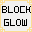
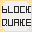
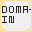
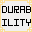

# 调试与查询指令

> 适用：Additional Abilities for DS `2.0.0`

本模组新增了一条独立的指令树 **`/additional-abilities`**（下辖 3 条调试子指令），
另**追加**了 2 条查询子命令到 Dragon Survival 的指令树上。全部需要**权限等级 2**
（与 `/effect clear` 同档，单机存档的拥有者默认满足）；独立指令树的权限判定统一施加在**根节点**上。

```
/additional-abilities
 ├─ simple-screen-vision clear <targets>      清空目标玩家身上的简单屏幕视觉
 ├─ domain clear <targets>                    清除目标玩家留下的领域
 └─ block-glow clear <targets>                清除目标玩家造成的方块发光
```

---

## 一、`/additional-abilities simple-screen-vision clear <targets>`

清空目标玩家身上**所有**简单屏幕视觉效果（`simple_screen_vision` 的抖动、模糊与边光）。

```
/additional-abilities simple-screen-vision clear Steve
/additional-abilities simple-screen-vision clear @a
/additional-abilities simple-screen-vision clear @a[distance=..10]
```

| 参数 | 说明 |
|---|---|
| `<targets>` | 用原版玩家选择器参数，所以**玩家名 / 目标选择器 / UUID** 三种写法都支持 |

执行成功会提示：`已清除 %s 名玩家身上的简单视觉效果`。

> **路径变更**：早期版本注册为独立根指令 `/simple-screen-vision`。现已**原样移入**
> `/additional-abilities` 之下 —— 子命令名、参数、行为、提示文案、返回值全部不变，只是路径多了一级；
> 旧的 `/simple-screen-vision` **不再注册**。

### 注意事项

- **只对玩家有效**。非玩家实体没有「画面」可言。
- **清空只对当下有效**。屏幕视觉完全是客户端的渲染状态，服务端不持有任何副本，能做的只是通知目标玩家清空。
  **被动技能会在下一拍重新下发** —— 想让效果彻底消失，得先停用/移除那个技能。
- 非玩家形态、旁观者模式下也不会有视觉残留，不用管。

---

## 二、`/additional-abilities domain clear <targets>`

清除目标玩家**作为施法者**建立的、当前仍然存活的**全部领域**
（即 `additional_abilities:domain` 目标类型留下的区域，见 [03-目标选择器.md](03-目标选择器.md)）。

```
/additional-abilities domain clear Steve
/additional-abilities domain clear @a
/additional-abilities domain clear @p[distance=..32]
```

| 参数 | 说明 |
|---|---|
| `<targets>` | 同上一节：**玩家名 / 目标选择器 / UUID** 都支持 |

执行成功会提示：`已清除 %1$s 名玩家建立的 %2$s 个领域`。
**指令返回值 = 实际被移除的领域数量**，可直接被 `/execute store result` 取用；名下没有存活领域时返回 `0`。

### 它到底清掉了什么

- 走的是与「自然到期」**完全相同**的移除路径，因此配了 `remove_effects_on_end: true` 的领域
  同样会对范围内目标执行一次收尾 `remove`（药水 / 属性修饰等立即撤销）。
- **不会**追溯撤销已经落在目标身上的限时效果：领域对目标做了什么完全由 `applied_effects` 里写的
  任意 DS 效果类型决定，没有一份「这个领域给谁加过什么」的通用账本可供撤销。
  所以「清除领域」的可靠含义就是**让这块区域不再存在** —— 此后不再结算、不再刷新效果，
  已经施加的限时效果按各自的 `duration` 自然过期。
- **跨维度扫描**：领域挂在各维度自己的数据上，施法者一旦换了维度，旧维度里的领域**不会**自动消失
  （它只是「施法者不可用」而被跳过结算，仍会照常倒计时）。因此本指令遍历所有维度，
  而不是只看施法者当前所在的那个。
- 计数口径是**领域个数**：同一技能「一次施法 = 一个领域」（多个 action 会合并进同一个），
  所以它对应的是「施法次数」，不是「action 个数」。

### 使用场景

- 领域是**不持久化**的纯内存对象（服务端重启即消失），但正常游玩中一个 `duration` 设得很长的领域
  会拖慢调试节奏 —— 用它立即收场，不必干等；
- 验证 `remove_effects_on_end` 的收尾行为是否符合预期；
- 确认「重新施法是否顶掉了旧领域」：先 `clear`，再施法，观察返回值变化。

---

## 三、`/additional-abilities block-glow clear <targets>`

清除 `additional_abilities:glow` 方块效果留下的、由 `<targets>` 选中的玩家**作为施法者**造成的方块发光
（见 [02-方块效果.md](02-方块效果.md)）。

```text
/additional-abilities block-glow clear Steve
/additional-abilities block-glow clear @a
/additional-abilities block-glow clear @p[distance=..32]
```

### 它到底清掉了什么

`<targets>` 选的是**造成者**，不是"画面被影响的人" —— 与上一节 `domain clear` 同口径。

- 方块发光在服务端按「位置 + 颜色 + 显示类型」**共享**（正是这一点让不同施法者的效果可以叠加），
  所以服务端并不知道"某处发光只属于谁的画面"。可靠的语义只能是**撤销这些施法者的贡献**；
- 某处发光还有别的玩家在贡献时**原地保留**，不会误伤别人；
- 一旦某处发光再无任何贡献者，整条消失，并**立刻**通知附近玩家不再渲染它
  （否则最多要等 20 刻的下一次刷新）。

### 返回值

返回被**整条**移除的发光条目数（可直接被 `/execute store result` 取用）；
目标玩家名下没有存活贡献时为 `0`，并如实提示。

### 与「等它自然过期」的区别

| | 生效时机 | 影响范围 |
|---|---|---|
| 等 `duration` 走完 | 最长可达 60 秒 | 该条发光自己 |
| 本指令 | **立刻** | 只撤销 `<targets>` 的贡献；他人的发光照旧 |

### 注意事项

- **它是调试用的"撤销"，不是"熄灭开关"**：技能仍在持续触发时，下一拍就会重新登记发光。
  要让效果彻底消失，得先停用技能。
- 清空只对当下有效：客户端收到的是"这条已失效"的通知，服务端不会再刷新它。

---

## 四、`/dragon-ability query <目标> <技能> current_charged_level`

在 DS 自带的技能查询指令下**追加**的两项之一，用于蓄力档位族系
（`additional_abilities:charged` 与 `additional_abilities:optional_charged`）：

```
/dragon-ability query @s additional_abilities:test_charged current_charged_level
```

| 情况 | 返回值 |
|---|---|
| 正在蓄力 | 当前蓄力所对应的**档位** |
| 没在蓄力 | **最近一次实际释放**所用的档位（"取消施法"不写入） |
| 该技能的激活类型不是蓄力档位 | `0` |

输出格式直接复用 DS 自己的查询结果文案，与 `level` / `cast_time` 等既有条目**显示格式完全一致**。

### 与 `level` 的区别

| 查询项 | 含义 |
|---|---|
| `level` | 玩家**升级**到的技能等级（技能的成长进度） |
| `current_charged_level` | **本次施法实际使用的档位**（蓄力结果），可能低于 `level` |

**蓄力技能的伤害、冷却、耗蓝、时长全部按 `current_charged_level` 结算**，所以调试数值时看这一项，
不要看 `level`。

---

## 五、`/dragon-ability query <目标> <技能> current_selected_level`

配合 `additional_abilities:optional_charged`（可选性蓄力档位）的滚轮选档：

```
/dragon-ability query @s additional_abilities:test_optional_charged current_selected_level
```

| 情况 | 返回值 |
|---|---|
| 玩家用滚轮手动选定过档位 | **选定的释放档位**（`0` 表示已选定为"取消，不释放"） |
| 处于自动跟随（没滚动过，或滚回了已蓄档位） | **已蓄到的档位**（即此刻松手实际会用的档位） |
| 未在蓄力，或蓄力还没到第 1 档 | `-1`（未指定） |
| 该技能的激活类型不是蓄力档位 | `-1` |

**选档不参与任何数值结算**：真正生效的档位由释放包单独上报，并在服务端重新校验 / 钳制。
该项只是把客户端的选档状态暴露出来，方便确认"松手时到底会放几档"。
服务端在每次施法收尾（释放或取消）时清掉记录，因此不会残留到下一次施法。

> **为什么自动跟随返回的是档位数字而不是 `-1`**：`-1` 只用于表达"没有可参照的档位"。
> 玩家滚回顶端（或从未滚动）时客户端会恢复自动跟随，此时明明能算出具体档位，
> 报告"未指定"只会误导调试 —— 查询回答的是"松手会放几档"，不是"玩家有没有手动拨过滚轮"。

### 与 `current_charged_level` 的区别

| 查询项 | 含义 |
|---|---|
| `current_charged_level` | **已蓄到**的档位（蓄力进度换算值） |
| `current_selected_level` | **将要释放**的档位（玩家滚轮选定值），恒不超过已蓄到的档位 |

---

## 六、DS 自带的查询项

`/dragon-ability query <目标> <技能>` 下原有这些子项，可与上面两条混着用：

| 子项 | 含义 |
|---|---|
| `level` | 当前技能等级 |
| `max_level` | 最高等级 |
| `current_cooldown` | 剩余冷却 |
| `cooldown` | 该等级对应的冷却总长 |
| `current_tick` | 当前施法已进行的刻数（蓄力时就是蓄力刻数） |
| `cast_time` | 该等级对应的施法 / 蓄力总长 |
| `is_applying_effects` | 是否正在应用效果（`1` / `0`） |

---

## 七、手动授予技能

 ...

本模组的测试技能（`test_*`）没有挂在任何龙种下，调试时需要手动授予：

```
/dragon-ability add @s additional_abilities:test_charged
/dragon-ability add @s additional_abilities:test_anti_dragon_breath
/dragon-ability remove @s additional_abilities:test_charged
/dragon-ability refresh @s
```

- `add` 会把技能加给目标玩家（技能等级从最低开始，需要按升级条件自行提升）；
- `remove` 移除；
- `refresh` 重新按数据包刷新技能数据，改完 JSON 后用它。

> 调试 `additional_abilities:domain` 时注意：**等级 0 的主动技能无法施放**（DS 的施法前校验会拦截），
> 所以 `test_domain` 授予后还要先把等级提上去，或临时把它改成 `passive`。
